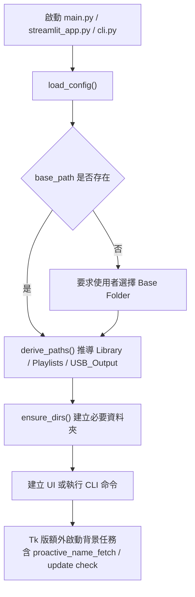
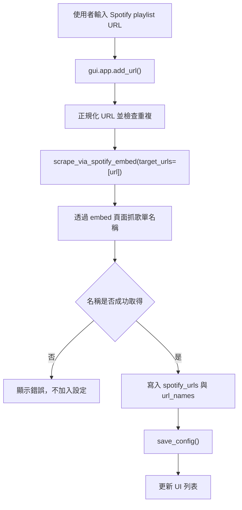
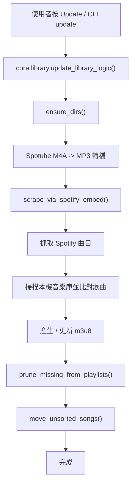
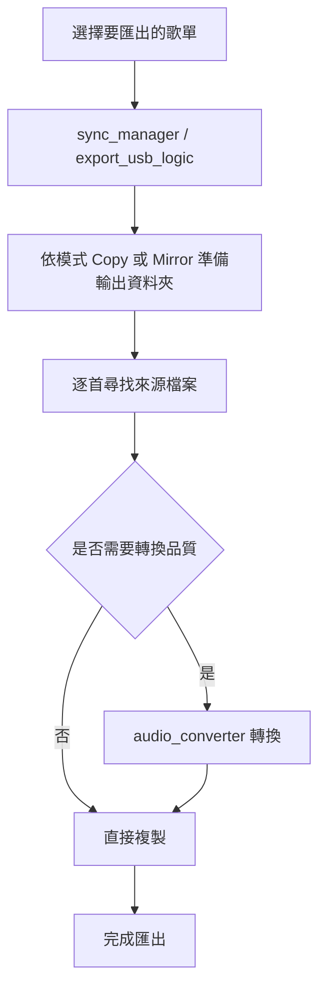

# Playlist Administrator 架構與流程

## 專案定位

Playlist Administrator 是一個以本機音樂庫為核心的歌單管理工具，主要用途不是下載音樂，而是：

- 從 Spotify `playlist` URL 抓取歌單曲目
- 用本機音樂庫做歌曲比對
- 產生或更新 `.m3u8` 播放清單
- 清理遺失曲目、整理未分類歌曲
- 視需要把 Spotube 來源的 `M4A` 轉成 `MP3`
- 匯出指定歌單到 USB / SD

目前專案同時有三個入口：

- `main.py`: Tkinter 桌面版主介面
- `streamlit_app.py`: Streamlit 網頁版介面
- `cli.py`: 命令列工具

## 核心模組

### 入口層

- `main.py`
  - 建立 Tk root
  - 初始化 `gui.app.PlaylistApp`
- `streamlit_app.py`
  - 提供簡化版操作面板
  - 可做更新、歌單管理、匯出、設定
- `cli.py`
  - 提供 `update`、`scrape`、`match`、`fetch-playlist`

### GUI 層

- `gui/app.py`
  - 主視窗、歌單列表、更新流程、播放器、狀態顯示
  - 也包含 URL 新增、歌單檢視、背景更新檢查等行為
- `gui/settings.py`
  - Tkinter 設定視窗
  - 目前仍包含 Spotube 轉檔相關選項
- `gui/update_dialog.py`
  - 版本更新通知視窗

### 核心流程層

- `core/library.py`
  - 專案最核心的工作流
  - `update_library_logic()` 依序執行資料夾建立、Spotube 轉檔、Spotify 抓取、播放清單清理、未分類整理
- `core/spotify.py`
  - `scrape_via_spotify_embed()` 是 Spotify 歌單同步主流程
  - 也負責 URL 名稱抓取與本機檔案比對
- `core/spotify_playlist_fetcher.py`
  - 專注在 Spotify embed 頁面的曲目抓取
- `core/sync_manager.py`
  - 負責輸出 / 同步到外部資料夾
- `core/audio_converter.py`
  - 音訊格式轉換與 metadata 遷移
- `core/ffmpeg_installer.py`
  - FFmpeg 檢查與路徑處理

### 共用工具層

- `utils/config.py`
  - 載入 / 儲存設定
  - 推導 `library_path`、`playlists_path`、`export_path`
- `utils/i18n.py`
  - 中英文切換
- `utils/helpers.py`
  - 檔名清理、字串正規化

## 實際執行流程

### 啟動流程

### 新增 Spotify 歌單流程

### 全量更新流程

### 匯出流程

## 設定與資料位置

### 設定檔

- 主要 app data 設定檔：
  - `%LOCALAPPDATA%\\Playlist Administrator\\data\\config.json`
- 若設定了 `base_path`：
  - `base_path\\config.json` 會成為主要設定來源
- app data 下的設定會保留一份 pointer：
  - 至少記住 `base_path` 與 `language`

### 由 `base_path` 推導出的路徑

- `library_path`
  - 通常是 `base_path\\Music`
  - 但若 `base_path` 本身看起來就是音樂根目錄，則直接使用 `base_path`
- `playlists_path`
  - `base_path\\Playlists`
- `export_path`
  - `base_path\\USB_Output`

## 目前觀察到的真實狀態

### 仍然存在但文件曾寫成已移除

- Spotube M4A 轉 MP3 流程仍存在
  - `core/library.py` 的 `convert_spotube_m4a_to_mp3()`
- `spotube_convert_matched_only` 仍在使用
- `spotube_strict_matching` 仍在使用
- `spotube_m4a_subfolder` / `spotube_mp3_subfolder` 雖然沒有預設值，但底層函數仍支援

### 明顯屬於殘留邏輯

- `gui/app.py` 啟動時會 `after(500)` 呼叫 `proactive_name_fetch`
- `gui/app.py` 的 `view_playlist_songs()` 仍顯示 `spotify_fetch_method` / `spotify_client_id`
- `spotify_fetch_method`、`spotify_client_id`、`spotify_client_secret` 已不再是主流程必要設定

## 專案目前最重要的幾條主線

1. Spotify embed 抓歌單
2. 本機音樂檔名 / metadata 比對
3. 播放清單輸出與整理
4. Spotube M4A 轉 MP3 輔助流程
5. 匯出到外部裝置

## 建議閱讀順序

1. `main.py`
2. `gui/app.py`
3. `core/library.py`
4. `core/spotify.py`
5. `core/spotify_playlist_fetcher.py`
6. `utils/config.py`
7. `gui/settings.py`
